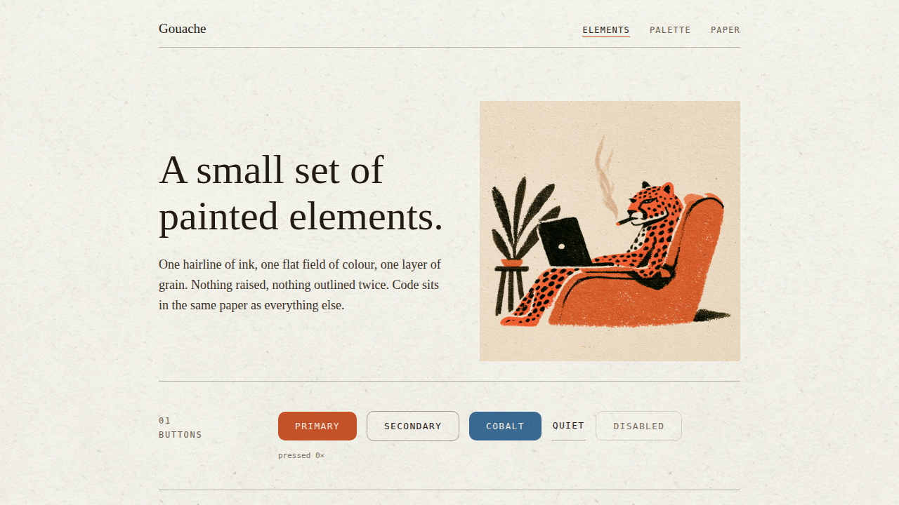

# Gouache Kit



A small set of painted UI elements — buttons, fields, tags, tabs, a hoverable node graph, a chat composer, live search, and a split-pane markdown editor — built on a paper-grain visual system: one hairline of ink, one flat field of colour, one layer of grain.

Originally mocked up in [Claude Design](https://claude.ai/design) and implemented here as a real **Vite + React + TypeScript** app.

## Run it

```bash
npm install
npm run dev
```

## Build

```bash
npm run build
```

## Structure

- `src/components/` — the reusable kit: `Button`, `TextField`/`TextAreaField`, `Toggle`, `Checkbox`, `Tag`, `Avatar`, `Tabs`, `Plate`, `CodeBlock`, `Dialog`, `NodeGraph`, `ChatPanel`, `SearchBar`, `MarkdownEditor`, `BlogCard`
- `src/App.tsx` — the showcase page composing all of the above
- `src/theme.ts`, `src/styles/global.css` — shared color/type tokens and the paper-grain CSS system
- `public/` — the paper texture and illustration assets

## Original design bundle

`project/` and `chats/` hold the original Claude Design handoff (the `.dc.html` prototype and the design conversation that produced it) — kept for reference, not used at runtime.
